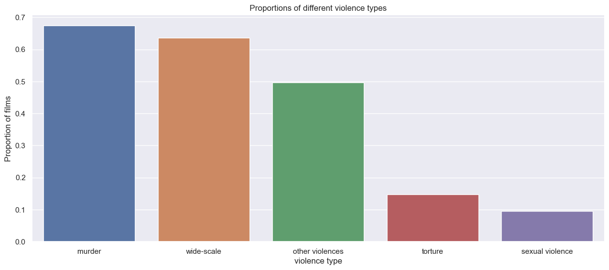
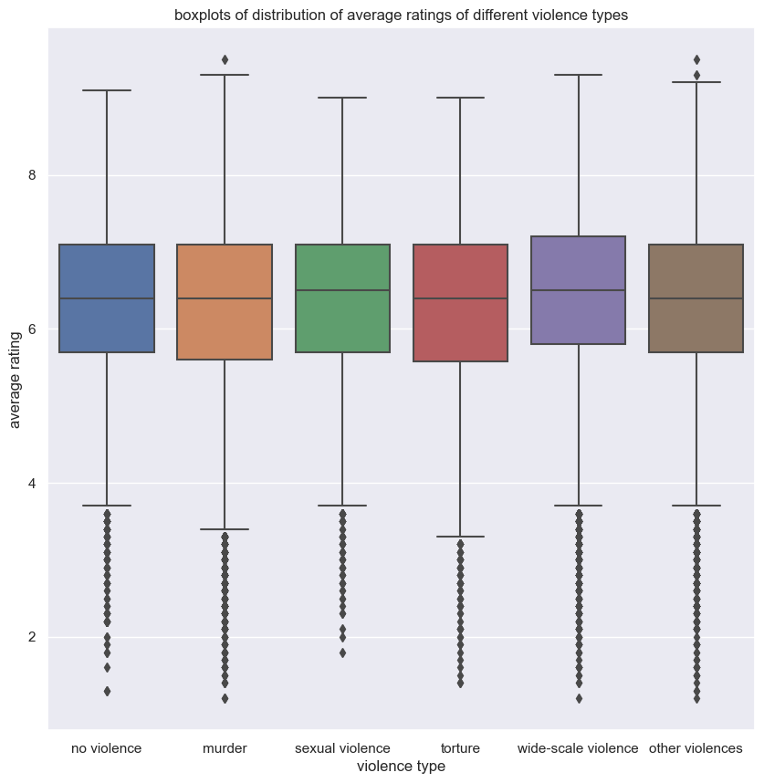

* * *

This data story studies the presence of violence in the [CMU Movie Summary Corpus](http://www.cs.cmu.edu/~ark/personas/). We use a bag-of-words approach to detect different types of violence in a movie summary. In particular, we lowercase the movie summary corpus and match only the base form of a word to include word variations. The following word cloud shows the 130 words in our violence dictionary colored by type of violence. A word's frequency in the movie summary corpus determines its size in the word cloud. 

We can notice the difference of representation by looking at the proportion of films that contain a certain type of violence for each type. Sexual violence and torture are in the minority. 

We measure the appreciation of violence in movies through the box office revenue. In particular, we do a regression analysis with the revenue as outcome and indicator variables for each type of violence as predictors. The following plot shows the regression coefficients for each type of violence. 

Murder, wide-scale violence, and other violence positevely influences movie revenue. The presence of each of the before adds more than 19 million US dollars (USD) to the table on average. On the other hand, the revenue of sexually violent films is on average more than 14 million USD less than the revenue of not sexually violent movies. For torture, we cannot make a significant statement.

The problem with the previous analysis is that we do not consider confounding factors on revenue. One possible confounder hypothesis would be the movie budget, as a high investment expects high revenues. At the same time, a film with a high budget tends to be more spectacular, therefore, more likely to show battles or confrontations. So we scraped the movie budgets from [IMDB](https://www.imdb.com/) to deepen our analysis. Indeed, the Pearson correlation coefficient between revenue and budget is 0.69 at a p-value that tends to zero, indicating a relation between budget and revenue. Another indicator that budget might be a confounding factor is that more than 90% of high-budget movies are violent. Hence,  we create a balanced dataset of pairs of violent and non-violent movies matched by budget. We also match the decades of production to account for inflation. Our matching contains 481 pairs. Now we do a regression analysis with the indicator of violence as a predictor and revenue as an outcome. Here we only use the presence of any violence as a predictor and not the fine-grained types because we matched on the presence of general violence. The following plot compares the regression results on the matched dataset to the unmatched dataset.

Although the influence of violence on movie revenue decreases, it still has a significant contribution of more than 24 million USD on average. Altogether our results show that the public appreciates violence in movies. 

We will now, study movie ratings, i.e., how well films are evaluated instead of the revenue they make. From IMDb, we get average ratings of films with a number of votes superior than 50. Then, we can display the distribution of average rating of the movies for each category of violence including a new category of no violence, which corresponds to a film without violence. Note that the average figure is an average of average ratings. The first order of average is an average over a voters community. The second order of average is the average of the average ratings of films for one category of violence. See the following boxplots 

As we can see, the type of violence doesn't to affect average ratings that much. However, we can observe that movies with sexual violence are the furthest away from zero and that movies without violence are in worse rated than movies with violence, except for those with torture. Concerning, the types of violence, on average(arithmetic mean), sexual violence and wide-scale violence have the best score, 6.31 and 6.36 respectively, with torture being the least appreciated type of violence with a score of 6.24. The average score is 6.28 for all films, and for films without violence the average score is 6.26. The mediums on the boxplot confirm these trends.

After measuring the appreciation of violence, we want to evaluate the tolerance towards violence in movies. Furthermore, we want to determine if the context of violence influences tolerance. Our approach is to use the genre of a movie as a proxy for the context of violence. First, we catch a glimpse of the distribution of films through genres and determine popular types of violence in a genre. The following interactive graphic has one dot for each genre with more than 60 movies. A genre's popup shows the absolute number of films, the dominant type of violence, and each type of violence's percentage of films containing this kind of violence. The nodes can be sized by the forenamed ratios and absolute values and grouped by the dominant type of violence. Furthermore, one can filter for the ten most popular genres according to the number of movies. 

We observe that murder and wide-scale violence are the dominant types of violence. Furthermore, the presence of any violence, murder, wide-scale violence, and other violence is about of the same order of magnitude across all genres. However, some genres are prone to torture and sexual violence, but others are not. For example, a third of all movies in adult genres contain sexual violence, whereas less than 5% of all comedies have sexual violence. For torture, we can draw a similar picture - it is more common among slasher (46%), cult (33%), and horror (31%) movies and less common for romance (6.9%) and comedy (8.4%) movies. 

Now we dive deeper into violence in genres and analyze for the ten genres with the most movies how the presence of a type of violence contributes to a parental rating of a film. We use the [parental rating certificates](https://help.imdb.com/article/contribution/titles/certificates/GU757M8ZJ9ZPXB39?ref_=helpart_nav_27#) that we scraped from [IMDB](https://www.imdb.com). We average all available parental ratings of different countries for each film. Averaging gives us one minimum age per film that certificate authorities recommend for people to watch this movie. Afterward, we do a regression analysis with the mean parental rating as the outcome and the type of violence indicators as binary predictors. The plot below shows the regression coefficients. The intercept denotes the average parental rating for a movie with no detected type of violence. 

Overall genres, the presence of other violence has a not significant or small significant positive or negative contribution to the parental ratings. Interestingly, the existence of wide-scale violence tends to reduce the parental rating. The presence of torture, sexual violence, or murder increases a film's parental rating by more than two years on average. The tolerance towards murder and torture is volatile across genres. Consider horror movies and thrillers. Both have a high parental rating without the presence of any violence. However, thrillers tolerate murder more than horror movies, but horror movies tolerate torture more than thrillers. The tolerance towards sexual violence is more constant. Its presence adds at least 1.1 years to the parental rating in any of the most popular genres.  Fascinating are also comedies. Without any violence, they have a lower parental rating than the average movie without violence. However, they are more tolerant of torture and murder. 

### Country restrictions on violent scenes

We continue working with the parental ratings and now also consider the parental guide from IMDb. This data set additionaly contains information on the explicitness of violent scenes. Here we will first compare the information extracted on the type of violence from the film summary of the movie and compare it to the violence types extracted from the parental guide advisory. 

Overall genres, violence is much more detected by the summary analysis. However, concerning murders and scenes of sexual violence, there is more detection on the parental guide. This is because the summaries do not disclose the presence of violence in specific scenes of the film, especially in the case of torture and sexual scenes. 

For the following analysis, we keep the dataset from the parental guide advisory since it gives us more information about the shocking nature of the scenes.

Each country has its tolerance for violence. Therefore, it's interesting to compare the differences. The following plot represents the mean of the age restriction among 1500 films from 10 different countries. On the y-axis is the mean of the age restriction for all violent films and three subcategories of violence. 

Germany, Sweden, and the Netherlands assign a higher age warning for torture than sexual abuse. For the rest of the countries, sexual violence is more penalized. Argentina, the United Kingdom, and South Korea are the most restrictive about sexual violence, with a difference of 0.86, 0.81, 0.86, respectively, with the average of the violent films.

Temporal analysis can also give us information about the variation of parental certificates. 

For the majority of these countries, the average age advisory drops. It drops most in Norway, where the average age of restriction declined by 3.08 years in 30 years.