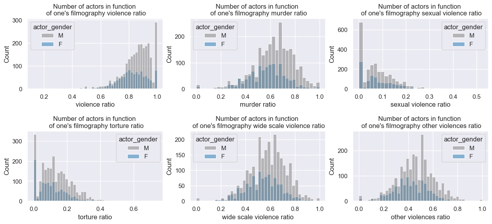

* * * 
# Representations of violence and public appraisal

## Abstract 
After the Aurora shooting in Colorado in July 2012 (twelve people killed and 58 others injured), during the premiere of The Dark Knight Rises, controversy arose around the release of the film Joker. Considered too violent, very strict security measures were taken before its theatrical release, where it is rated R. Violence has always been a pillar in media. From tragic Greek theater to public executions, its powerful emotional impact stirs attention. In films, violence can manifest in increased sensory details. The representation of violence can be, depending on the audience's appreciation, the era, the culture, more or less explicit, more or less tolerated with different stereotypes in play. Our project aims to analyze the co-dependency between public appraisal, tolerance, and representations of violence, under different dimensions such as financial success, the tone of the films (comedy or drama), and geo-political context (nation, era).

This data story studies the presence of violence in the [CMU Movie Summary Corpus](http://www.cs.cmu.edu/~ark/personas/). We use a bag-of-words approach to detect different types of violence in a movie summary. In particular, we lowercase the movie summary corpus and match only the base form of a word to include word variations. The following word cloud shows the 130 words in our violence dictionary colored by type of violence. A word's frequency in the movie summary corpus determines its size in the word cloud. 

We can notice the difference of representation by looking at the proportion of films that contain a certain type of violence for each type. Sexual violence and torture are in the minority. 

We measure the appreciation of violence in movies through the box office revenue. In particular, we do a regression analysis with the revenue as outcome and indicator variables for each type of violence as predictors. The following plot shows the regression coefficients for each type of violence. 

Murder, wide-scale violence, and other violence positevely influences movie revenue. The presence of each of the before adds more than 19 million US dollars (USD) to the table on average. On the other hand, the revenue of sexually violent films is on average more than 14 million USD less than the revenue of not sexually violent movies. For torture, we cannot make a significant statement.

The problem with the previous analysis is that we do not consider confounding factors on revenue. One possible confounder hypothesis would be the movie budget, as a high investment expects high revenues. At the same time, a film with a high budget tends to be more spectacular, therefore, more likely to show battles or confrontations. So we scraped the movie budgets from [IMDB](https://www.imdb.com/) to deepen our analysis. Indeed, the Pearson correlation coefficient between revenue and budget is 0.69 at a p-value that tends to zero, indicating a relation between budget and revenue. Another indicator that budget might be a confounding factor is that more than 90% of high-budget movies are violent. Hence,  we create a balanced dataset of pairs of violent and non-violent movies matched by budget. We also match the decades of production to account for inflation. Our matching contains 481 pairs. Now we do a regression analysis with the indicator of violence as a predictor and revenue as an outcome. Here we only use the presence of any violence as a predictor and not the fine-grained types because we matched on the presence of general violence. The following plot compares the regression results on the matched dataset to the unmatched dataset.

Although the influence of violence on movie revenue decreases, it still has a significant contribution of more than 24 million USD on average. Altogether our results show that the public appreciates violence in movies. 

We will now, study movie ratings, i.e., how well films are evaluated instead of the revenue they make. From IMDb, we get average ratings of films with a number of votes superior than 50. Then, we can display the distribution of average rating of the movies for each category of violence including a new category of no violence, which corresponds to a film without violence. Note that the average figure is an average of average ratings. The first order of average is an average over a voters community. The second order of average is the average of the average ratings of films for one category of violence. See the following boxplots 

As we can see, the type of violence doesn't to affect average ratings that much. However, we can observe that movies with sexual violence are the furthest away from zero and that movies without violence are in worse rated than movies with violence, except for those with torture. Concerning, the types of violence, on average(arithmetic mean), sexual violence and wide-scale violence have the best score, 6.31 and 6.36 respectively, with torture being the least appreciated type of violence with a score of 6.24. The average score is 6.28 for all films, and for films without violence the average score is 6.26. The mediums on the boxplot confirm these trends.

After measuring the appreciation of violence, we want to evaluate the tolerance towards violence in movies. Furthermore, we want to determine if the context of violence influences tolerance. Our approach is to use the genre of a movie as a proxy for the context of violence. First, we catch a glimpse of the distribution of films through genres and determine popular types of violence in a genre. The following interactive graphic has one dot for each genre with more than 60 movies. A genre's popup shows the absolute number of films, the dominant type of violence, and each type of violence's percentage of films containing this kind of violence. The nodes can be sized by the forenamed ratios and absolute values and grouped by the dominant type of violence. Furthermore, one can filter for the ten most popular genres according to the number of movies. 

We observe that murder and wide-scale violence are the dominant types of violence. Furthermore, the presence of any violence, murder, wide-scale violence, and other violence is about of the same order of magnitude across all genres. However, some genres are prone to torture and sexual violence, but others are not. For example, a third of all movies in adult genres contain sexual violence, whereas less than 5% of all comedies have sexual violence. For torture, we can draw a similar picture - it is more common among slasher (46%), cult (33%), and horror (31%) movies and less common for romance (6.9%) and comedy (8.4%) movies. 

Now we dive deeper into violence in genres and analyze for the ten genres with the most movies how the presence of a type of violence contributes to a parental rating of a film. We use the [parental rating certificates](https://help.imdb.com/article/contribution/titles/certificates/GU757M8ZJ9ZPXB39?ref_=helpart_nav_27#) that we scraped from [IMDB](https://www.imdb.com). We average all available parental ratings of different countries for each film. Averaging gives us one minimum age per film that certificate authorities recommend for people to watch this movie. Afterward, we do a regression analysis with the mean parental rating as the outcome and the type of violence indicators as binary predictors. The plot below shows the regression coefficients. The intercept denotes the average parental rating for a movie with no detected type of violence. 

Overall genres, the presence of other violence has a not significant or small significant positive or negative contribution to the parental ratings. Interestingly, the existence of wide-scale violence tends to reduce the parental rating. The presence of torture, sexual violence, or murder increases a film's parental rating by more than two years on average. The tolerance towards murder and torture is volatile across genres. Consider horror movies and thrillers. Both have a high parental rating without the presence of any violence. However, thrillers tolerate murder more than horror movies, but horror movies tolerate torture more than thrillers. The tolerance towards sexual violence is more constant. Its presence adds at least 1.1 years to the parental rating in any of the most popular genres.  Fascinating are also comedies. Without any violence, they have a lower parental rating than the average movie without violence. However, they are more tolerant of torture and murder. 

### Country restrictions on violent scenes

We continue working with the parental ratings and now also consider the parental guide from IMDb. This data set additionaly contains information on the explicitness of violent scenes. Here we will first compare the information extracted on the type of violence from the film summary of the movie and compare it to the violence types extracted from the parental guide advisory. 

Overall genres, violence is much more detected by the summary analysis. However, concerning murders and scenes of sexual violence, there is more detection on the parental guide. This is because the summaries do not disclose the presence of violence in specific scenes of the film, especially in the case of torture and sexual scenes. 

For the following analysis, we keep the dataset from the parental guide advisory since it gives us more information about the shocking nature of the scenes.

Each country has its tolerance for violence. Therefore, it's interesting to compare the differences. The following plot represents the mean of the age restriction among 1500 films from 10 different countries. On the y-axis is the mean of the age restriction for all violent films and three subcategories of violence. 

Germany, Sweden, and the Netherlands assign a higher age warning for torture than sexual abuse. For the rest of the countries, sexual violence is more penalized. Argentina, the United Kingdom, and South Korea are the most restrictive about sexual violence, with a difference of 0.86, 0.81, 0.86, respectively, with the average of the violent films.

Temporal analysis can also give us information about the variation of parental certificates. 

For the majority of these countries, the average age advisory drops. It drops most in Norway, where the average age of restriction declined by 3.08 years in 30 years.

* * *
# How is violence represented in different countries and languages?

* * *

The representation of violence can be as varied as one's imagination allows because it is such a broad topic.
Its level of public acceptance of explicitness is a difficult threshold to draw for universal acclaim.
Different cultures tolerate this kind of representation to varying degrees.
Naturally, when we refer to culture, we mean people from different parts of the world as well as from diverse historical periods.
Each person's background towards violence is unique, and this background may have historical roots.
Conflicts, instability, and morality can influence people's desire to see explicit violence.

* * *

## Violence throughout the decades

As in the rest of our project we separate 4 different types of violence namely **"murder"**, **"torture"**, **"widescale violence"** and **"sexual violence"**.

We decide to plot the ratio of movies containing words related to the previously stated types of violence in function of release year. 

These distributions show us two main things:
- **Murder and wide-scale violence have always been the most represented violence types compared to torture and sexual violence.**
The last two barely reach 10% of representation in their best decades, but wide-scale violence and murder are almost touching 50%. One explanation (shown in the previous part) is that presence of terms related to murder, and wide-scale violence does not necessarily mean that this violence is explicit and showed graphically. Torture and sexual violence are not as promoted in the summary. 
This can be linked to those types of violence being less appealing, and more taboo around the world. 

- **Each type of violence is experiencing a increasing representation through the decades, following a big peak, this peak happens in a different decades**
The most striking example is sexual violence, its representation more than doubles between the 50's and the 70's. Between these decades the United States experienced a sexual liberation, that comes with a speech freedom around sexual violence. The soft power of the US during theses years was huge and this revolution surely impact other countries around the world. However, we must temper this analysis: this type of violence remains marginal and is clearly not one of the most striking of the 1970s.
Wide-scale violence see its peak in the 40s. We can try to explain it by the world war that happens during this time period. A fun thing to notice is that during the few decades after the world war II the top genre of movies with wide-scale violence in their summary was "Drama" by far. However in the 70s the "Action" genre was the second most using these terms, in the 40s it was not even is the top10. This show a shift in the representation of violence. 

Even if the number of movies using different terms of violence in their summary is the same or is evolving does not mean that its representation is the same throughout the era. Everyone has already heard some parents say that "in my youth, the movies were telling a story now it's just blood and guns".

* * *

## Violence through the world

The world cannot always be treated as a whole. To add more subtlety to our story we will have to separate the different countries to understand why films representing different forms of violence are so common in our time. Each country has its own culture, trivializing more or less certain types of violence. Some are taboo or completely banned in many parts of the world, others are used on a large scale. This can be explained by the customs of the country, its religion, its politics (dictatorship, monarchy...), or its geo-political situation.

In this part, we will assume that if a country is producing a certain type of movie it is because people will go watch it. Simple supply and demand.

To realize this analysis we thought that interactive graphs would allow us to have a better vision of these differences. Indeed, our dataset contains more than 20,000 American films, which can prevent us from seeing a trend for other countries. In the following graphs, a simple click on the countries in the legend allows you to discard them. The *"other countries"* category contains all the countries for which the ratio was too small to be seen or to be interpreted.

### Wide-scale violence

### Murder

### Torture

### Sexual violence

As stated before at first the result does not seem to be that shocking. The US dominates all previous graphs. However, we can notice that their percentage of presence during the 60s is decreasing in all types of violence, meaning that the US had a more peaceful filmography during this decade. An explanation can be that the hippie movement was taking place in this country, it was a countercultural movement that promoted peace.

With these graphs, we can start to understand which types of violence can be more taboo in some countries than others. India is present in all graphs meaning that they produce movies with various types of violence, but we can point out that this country is less troubled by sexual violence than the other country. Their presence in the sexual violence graph is more consequent than the one in torture for example. This may be, sadly, related to the fact that rape and violence against women in India are common. India is undergoing a crisis of rape of women and young girls.

* * *

## Violence through languages

Let's now talk about languages, if french is known as the language of love which language is the violent one? 
To answer this question, we will look at the ratio of violent movies in various language filmographies. Our following graph show this ratio for languages with more than 60 movies.

Latin is the language of violence given that more than 90% of its filmography is violent. In comparison, Greek is the language with the less percentage of the violent film. Greek is referring to modern Greek since the movies that are using this language are for the most part Greek movies or their genre is "World movie". 

Following Latin, there are a lot of languages that can be grouped as "Chinese dialects". This can easily be explained by the fact that Hong Kong is one of the top violent movie producers with almost 90% of violent movies in its filmography. Even if English-speaking countries, English is not even in the top 10 violent languages. This is thanks to all the other countries that speak English as a national language.

* * *

### The most violent languages

Drama is one of the top genre in our dataset, it is not surprising to see it there. This genre is also knonwn to have a high percentage of violent movies. But what is more interesting is to see "Period piece" or "Costume drama" in the top 5. This show us that movies using latin are for the most part historic movies most surely ones depicting the Ancient Rome era, with its gladiator, wars, political slaughters etc. This is why Latin is the most violent language. As a side note some genre can be merged as other genre are used to depict Costume movies, here it will make sense to put those genres together (same apply for Period piece and Historic movies).

* * *

# Gender disparities

It can be interesting to see how genders relate to violence representations. 

Do men or women appear more often in violent content ? If yes, of which type ? 

To see, for each actor/ actress we can find the proportion of violent movies in which he plays out of the entire
filmography. Having done for each actor, we can then use histograms to visualize the distribution of the number of actors in function 
of the proportion of films, in the actor's filmography, that contain a certain type of violence in the summary. And we do a separate histogram
for each type of violence. The distributions of male and females are superposed to see the differences. 

* * *

We can see that the distributions of males and females differ mostly in scale. Indeed, there is significant higher number of male
actors. Otherwise, the distributions have similar shape between genders. On closer inspection, except for torture and sexual violence,
male distributions are skewed slightly to the right, meaning that there is a majority of males with high proportion of violence in their filmography. Also, notice that, on the top left histogram, there is a small bump of female actors with 50% violence in their filmography. 
Opposedly, on the bottom right histogram, there is a small bump of male actors who have a proportion close to 0 of "other violences",
which in our categorization, refers to lighter violence as opposed to murder, wide-scale violence, sexual violence and torture.

