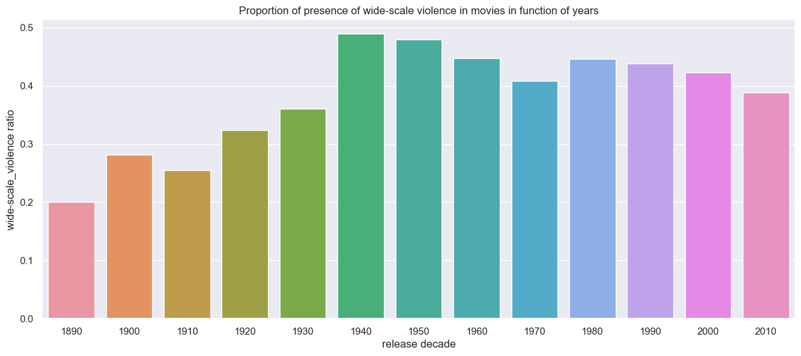
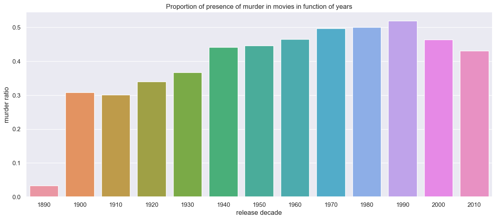
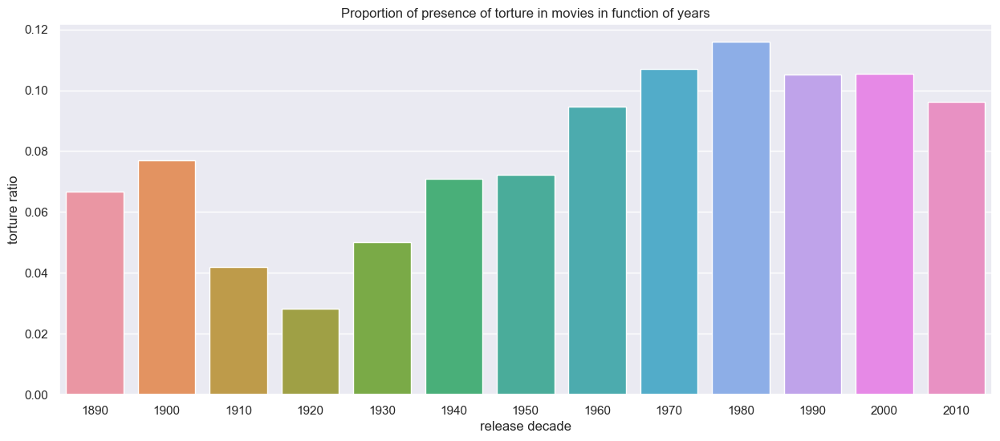
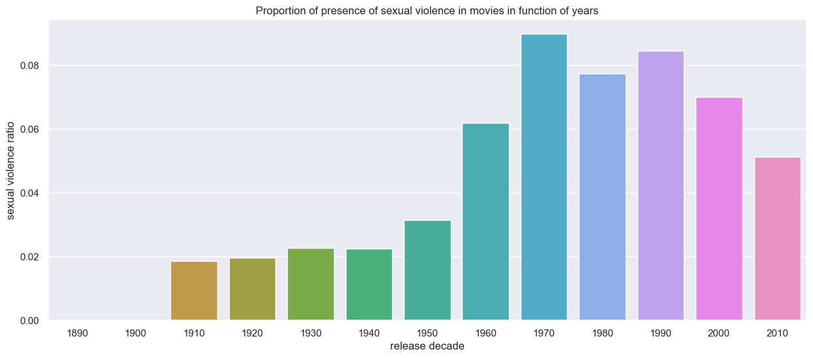

# How is violence represented in different countries and languages?

* * *

The representation of violence can be as varied as one's imagination allows because it is such a broad topic.
Its level of public acceptance of explicitness is a difficult threshold to draw for universal acclaim.
Different cultures tolerate this kind of representation to varying degrees.
Naturally, when we refer to culture, we mean people from different parts of the world as well as from diverse historical periods.
Each person's background towards violence is unique, and this background may have historical roots.
Conflicts, instability, and morality can influence people's desire to see explicit violence.

* * *

## Violence representation throughout the decades

As in the rest of our project we separate 4 different types of violence namely **"murder"**, **"torture"**, **"widescale violence"** and **"sexual violence"**.

We decide to plot the ratio of movies containing words related to the previously stated types of violence in function of release year. 

Theses distribution show us to main things:
- **Murder and wide-scale violence have always been the most represented type of violences compare to torture and sexual violence.**
> The last two barely reach the 10% of representation in their best decades, but wide-scale violence and murder are almost touching the 50%. One explanation (that has been showed in the previous part) is that presence of terms related to murder and wide-scale violent does not nececerally mean that this violence is explicit and is show graphically. Torture and sexual violence in the other hand are not as promoted in the summary. 
This can be linked to those type of violence to be less appealing, more taboo around the world. 

One thing that we can notice is the peak during the 40's. This can be linked to the two world wars. 

1. Murder

1. Torture

1. Sexual violence

